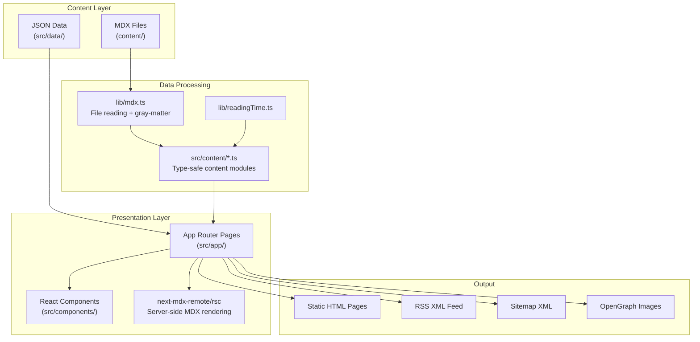

# Product Requirements Document — Minddump

## Cover

| Field | Value |
|---|---|
| **Project Name** | Minddump |
| **Internal Name** | `minddump` (package.json) |
| **Version** | 0.1.0 |
| **Generated Date** | 2026-06-27 |
| **Repository** | `Pranayy1/hello-pranay` (workspace corpus) |
| **Live URL** | https://minddump.dev |
| **Author** | Pranay |

**Short Description:** A personal learning journal and digital garden built with Next.js 15, React 19, Tailwind CSS 4, and MDX — where the author documents what they learn, build, fail at, and discover in public.

**Product Vision:** To create a living, evolving personal knowledge base that grows alongside its author — transforming private learning into public documentation that compounds over time.

**Product Mission:** Make the act of learning visible and intentional by providing a beautiful, minimal platform for writing, collecting quotes, tracking projects, and cataloguing daily engineering progress.

**Elevator Pitch:** Minddump is a premium personal website that goes beyond a portfolio. It combines long-form blog posts, a digital garden of short notes, a structured engineering learning log, a thought vault of curated quotes, project showcases with lessons learned, curated bookmarks, and a "now" page — all wrapped in an elegant dark-first design with light mode support, smooth animations, and a hidden easter egg.

---

## Executive Summary

### What Problem It Solves
Most developers consume vast amounts of knowledge but retain very little. Minddump solves this by providing a structured platform for "learning in public" — forcing the author to articulate what they've learned, what broke, and how they fixed it.

### Who It Is For
A single author (Pranay) who is a student and self-directed learner in programming, technology, networking, cybersecurity, game development, and software engineering.

### Why It Exists
Instead of waiting to become an expert, the author chose to document the journey. The site tagline captures this: *"Dump your mind. Build your knowledge."*

### Why Someone Would Use It
- Readers gain honest, beginner-to-intermediate perspective on technical topics
- The author uses it as a forcing function for deeper understanding
- It serves as a living portfolio demonstrating growth over time

### Major Features
1. **Blog Posts** — Long-form articles with MDX, reading time, draft support
2. **Digital Garden** — Short categorized notes with search and category filtering
3. **Thought Vault** — Curated quotes with favorites, search, category filters, sharing
4. **Learning Log** — Structured engineering journal (learned/problem/solution/reflection)
5. **Projects** — Showcase with status badges, tech stack, screenshots, lessons learned
6. **Bookmarks** — Curated external links with tags and notes
7. **Now Page** — Snapshot of current focus (learning/building/reading/exploring/goals)
8. **About Page** — Personal philosophy and mission statement
9. **Theme Toggle** — Dark/Light/System with localStorage persistence
10. **Easter Egg** — Secret modal triggered by typing "attention"
11. **RSS Feed** — XML feed of all blog posts
12. **SEO Suite** — Sitemap, robots.txt, OpenGraph images, JSON-LD, meta tags

### Current Maturity
Early-stage (v0.1.0). The content directories for posts, garden, bookmarks, and log are mostly empty. Nine thoughts exist, one project exists. The infrastructure is complete and production-ready; content is still being authored.

---

## Product Goals

### Primary Goals
- Document personal learning publicly with high fidelity
- Build a beautiful, fast, accessible personal website
- Create a sustainable writing practice (2 posts/month target)

### Secondary Goals
- Serve as a portfolio for potential employers/collaborators
- Inspire other learners to document their journeys
- Practice frontend engineering with modern tools

### Future Goals
- Ship 3 side projects and document them on the site
- Contribute to open-source and write about it
- Build a readership through consistent, valuable content

### Non-Goals
- Multi-user/CMS functionality
- Comments or social features
- Monetization or ads
- Analytics dashboard (no analytics code present)
- Newsletter/email subscription

### Success Metrics & KPIs
| Metric | Target |
|---|---|
| Posts per month | 2 |
| Side projects shipped per year | 3 |
| Garden notes created | Growing monthly |
| Open-source contributions | ≥1 |
| Site uptime | 99.9% |
| Lighthouse performance score | >90 |

---

## Target Users

### Persona 1: The Author (Pranay)
- **Role:** Student, self-directed learner
- **Goals:** Document learning, build writing habit, create portfolio
- **Pain Points:** Forgetting what was learned, lack of accountability
- **Motivation:** Compound knowledge through public documentation
- **Daily Workflow:** Learn → encounter problem → solve it → write log entry or garden note → occasionally write full post
- **Expected Behavior:** Adds MDX files to content directories, deploys via git push

### Persona 2: Fellow Student/Learner
- **Goals:** Find relatable learning content from a peer
- **Pain Points:** Most tutorials assume expertise; wants honest beginner perspective
- **Motivation:** "If they can learn it, so can I"
- **Expected Behavior:** Reads posts, browses garden notes, bookmarks useful resources

### Persona 3: Hiring Manager / Recruiter
- **Goals:** Evaluate candidate's communication, curiosity, and technical depth
- **Pain Points:** Portfolios are often shallow or templated
- **Motivation:** Find evidence of genuine learning and problem-solving ability
- **Expected Behavior:** Reads about page, browses projects, skims recent posts

### Persona 4: Developer / Peer
- **Goals:** Discover interesting perspectives on tech topics
- **Pain Points:** Generic blog content; wants authentic voice
- **Motivation:** Intellectual curiosity, community
- **Expected Behavior:** Subscribes to RSS, shares interesting quotes from Thought Vault

---

## User Stories

| # | Story | Acceptance Criteria |
|---|---|---|
| US-01 | As a reader, I want to browse all blog posts sorted by date so I can find the latest writing | Posts page lists all non-draft posts in reverse chronological order with title, date, summary, reading time |
| US-02 | As a reader, I want to read a full blog post with proper typography | Post detail page renders MDX with custom components, shows date and reading time |
| US-03 | As a reader, I want to see recent posts on the homepage | Home page shows 3 most recent posts with links |
| US-04 | As a reader, I want to browse garden notes by category | Garden page has category filter pills and search functionality |
| US-05 | As a reader, I want to read a full garden note | Garden note detail page renders MDX with back navigation, category, date, reading time, tags |
| US-06 | As a reader, I want to browse curated quotes in the Thought Vault | Thoughts page displays all quotes as cards with category badges and author attribution |
| US-07 | As a reader, I want to search quotes by text, author, or tag | Search input filters quotes in real-time |
| US-08 | As a reader, I want to filter quotes by category | Category filter chips filter the displayed quotes |
| US-09 | As a reader, I want to favorite quotes | Heart button toggles favorite state; favorites filter shows only favorited quotes |
| US-10 | As a reader, I want to share a quote | Share button uses Web Share API or falls back to clipboard copy |
| US-11 | As a reader, I want to see what the author is currently focused on | Now page shows learning, building, reading, exploring, and goals sections |
| US-12 | As a reader, I want to browse the author's projects | Projects page lists all projects sorted by status then date |
| US-13 | As a reader, I want to see project details including tech stack and lessons | Project card shows name, description, status badge, tech tags, screenshots, lessons, dates, GitHub link |
| US-14 | As a reader, I want to browse curated bookmarks | Bookmarks page lists all bookmarks with title, note, tags, and external link |
| US-15 | As a reader, I want to read the author's learning log | Log page shows timeline of entries with learned/problem previews |
| US-16 | As a reader, I want to read a full log entry | Log detail page shows structured sections: learned, problem, solution, resources, reflection, plus MDX content |
| US-17 | As a reader, I want to learn about the author | About page shows philosophy, mission, and a Socrates quote |
| US-18 | As a reader, I want to subscribe via RSS | RSS feed at /rss.xml contains all published posts |
| US-19 | As a reader, I want to toggle between dark and light mode | Theme toggle cycles dark→light→system with persistence |
| US-20 | As a power user, I want to discover the easter egg | Typing "attention" anywhere triggers a modal with philosophical lines |
| US-21 | As a user with reduced motion preferences, I want animations disabled | All animations respect prefers-reduced-motion media query |
| US-22 | As a keyboard user, I want to skip to main content | Skip link appears on focus |
| US-23 | As a search engine, I want structured data | JSON-LD, sitemap.xml, robots.txt, OpenGraph tags are present |
| US-24 | As the author, I want to add content by creating MDX files | Dropping .mdx files in content directories automatically makes them available |
| US-25 | As the author, I want to mark posts as drafts | Setting `draft: true` in frontmatter excludes content from listings |
| US-26 | As a mobile user, I want a responsive navigation menu | Hamburger menu with animated slide-down on mobile; horizontal nav on desktop |
| US-27 | As a first-time visitor, I want to be greeted with an impactful hero | Full-screen hero section with tagline, description, and CTA |

---

## Functional Requirements

### FR-01: Blog Posts System
- **Purpose:** Long-form writing with rich formatting
- **Content Source:** `content/posts/*.mdx` files
- **Frontmatter Schema:**
  ```yaml
  title: string (required)
  date: string (required, YYYY-MM-DD)
  summary: string (required)
  draft: boolean (optional, default false)
  ```
- **Listing:** `/posts` — all non-draft posts, sorted newest-first
- **Detail:** `/posts/[slug]` — full MDX rendering with custom components
- **Reading Time:** Auto-calculated via `reading-time` library
- **Static Generation:** `generateStaticParams` pre-renders all post pages
- **Empty State:** "Nothing published yet. The first post is being written."
- **SEO:** Dynamic metadata per post (title, description)

### FR-02: Digital Garden
- **Purpose:** Short-form notes organized by category
- **Content Source:** `content/garden/*.mdx` files
- **Frontmatter Schema:**
  ```yaml
  title: string (required)
  date: string (required)
  summary: string (required)
  category: GardenCategory (required)
  tags: string[] (optional)
  draft: boolean (optional)
  ```
- **Categories:** Programming, Life Lessons, Technology, Networking, Cybersecurity, Books, Random Thoughts
- **Listing:** `/garden` — filterable by category via query params, searchable via form submission
- **Detail:** `/garden/[slug]` — full MDX with back navigation, category, date, reading time, tags
- **Search:** Server-side filtering via `?search=` query parameter (title, summary, tags)
- **Category Filter:** Server-side via `?category=` query parameter
- **Empty State:** "The garden is waiting to be planted. Notes coming soon."

### FR-03: Thought Vault
- **Purpose:** Curated quote collection with interactive features
- **Content Source:** `content/thoughts/*.mdx` files
- **Frontmatter Schema:**
  ```yaml
  quote: string (required)
  author: string (optional)
  source: string (optional)
  category: Category (required)
  tags: string[] (optional)
  favorite: boolean (optional)
  date: string (required)
  ```
- **Categories:** attention, craft, decisions, failure, people, systems, writing, learning
- **Category Colors:** Each category has unique color (amber, orange, sky, rose, emerald, violet, pink, teal)
- **Client-Side Features:**
  - Real-time search (quote, author, tags, source)
  - Category filter chips with counts
  - Favorites filter with count
  - Toggle favorite (client-side state via Set)
  - Share quote (Web Share API → clipboard fallback)
  - Animated transitions (AnimatePresence with popLayout mode)
- **Sorting:** Favorites first, then newest-first
- **Empty States:** Different messages for search/favorites/empty vault

### FR-04: Learning Log
- **Purpose:** Structured engineering journal
- **Content Source:** `content/log/*.mdx` files
- **Frontmatter Schema:**
  ```yaml
  title: string (required)
  date: string (required)
  learned: string (required)
  problem: string (required)
  solution: string (required)
  resources: string[] (optional)
  reflection: string (required)
  draft: boolean (optional)
  ```
- **Listing:** `/log` — vertical timeline with dot indicators and connecting line
- **Detail:** `/log/[slug]` — structured sections (What I Learned, Problem Faced, Solution Found, Resources Used, Reflection) plus optional MDX body
- **Visual Design:** Timeline dots that change color on hover, monospace date formatting

### FR-05: Projects
- **Purpose:** Showcase builds with lessons learned
- **Content Source:** `content/projects/*.mdx` files
- **Frontmatter Schema:**
  ```yaml
  name: string (required)
  description: string (required)
  status: "idea" | "building" | "completed" | "archived" (required)
  tech: string[] (required)
  github: string (optional)
  screenshots: string[] (optional)
  lessons: string[] (required)
  started: string (required)
  ended: string (optional)
  ```
- **Status Badges:** Color-coded (amber=idea, sky=building, emerald=completed, zinc=archived)
- **Building Status:** Animated ping indicator (respects reduced motion)
- **Sorting:** By status priority (building→idea→completed→archived), then by start date
- **Card Features:** Name, description, status badge, screenshot carousel, tech tags, lessons list, date range, GitHub link

### FR-06: Bookmarks
- **Purpose:** Curated external links
- **Content Source:** `content/bookmarks/*.mdx` files
- **Frontmatter Schema:**
  ```yaml
  title: string (required)
  url: string (required)
  date: string (required)
  note: string (required)
  tags: string[] (optional)
  ```
- **Listing:** `/bookmarks` — cards with title, note, tags, external link icon
- **Links:** Open in new tab with `noopener noreferrer`
- **Empty State:** "No bookmarks yet. The reading list is being assembled."

### FR-07: Now Page
- **Purpose:** Snapshot of current focus areas
- **Data Source:** `src/data/now.json` (static JSON)
- **Sections:** Learning, Building, Reading, Exploring, Goals
- **Building Items:** Have status badges (active/early/paused)
- **Reading Items:** Have progress badges (reading/completed/queued)
- **Goals:** Checkbox-style display with done/not-done states
- **Footer:** "Last updated" timestamp
- **Inspiration:** Links to nownownow.com movement

### FR-08: Theme System
- **Modes:** Dark (default), Light, System
- **Persistence:** localStorage key `"theme"`
- **FOUC Prevention:** Inline `<script>` in `<head>` reads localStorage before paint
- **Cycle:** Dark → Light → System → Dark
- **System Mode:** Listens for `prefers-color-scheme` changes
- **Implementation:** Toggles `.dark`/`.light` classes on `<html>`, sets `colorScheme` style
- **Icons:** Moon (dark), Sun (light), Monitor (system) from lucide-react

### FR-09: Easter Egg
- **Trigger:** Type "attention" on keyboard (not in input fields)
- **Modal Content:** Three philosophical lines revealed sequentially with animation
  1. "Information is free."
  2. "Knowledge costs attention."
  3. "Wisdom costs experience."
- **Footer:** "you paid attention"
- **Accessibility:** Focus trap, Escape to close, proper ARIA attributes, dialog role
- **Buffer:** Rolling character buffer that checks against SECRET_WORD

### FR-10: RSS Feed
- **Route:** `/rss.xml` (Next.js route handler)
- **Format:** RSS 2.0 with Atom self-link
- **Content:** All published posts with title, link, guid, pubDate, description
- **Caching:** `Cache-Control: public, max-age=3600, s-maxage=3600`

### FR-11: SEO Infrastructure
- **Sitemap:** Dynamic generation including static routes + all posts, garden notes, log entries
- **Robots:** Allow all crawlers, reference sitemap URL
- **OpenGraph Image:** Edge-runtime generated PNG (1200×630) with site name, tagline, description
- **JSON-LD:** WebSite schema on every page
- **Meta Tags:** Title template `%s — Minddump`, description, OpenGraph, Twitter cards
- **Canonical URL:** Set via `alternates.canonical`
- **RSS Discovery:** `alternates.types` for RSS

---

## Non-Functional Requirements

| Category | Requirement |
|---|---|
| **Performance** | Static generation via `generateStaticParams`; edge-runtime OG images; CSS-only scrollbar styling |
| **Accessibility** | Skip-to-content link; focus-visible outlines; sr-only text; ARIA labels on all interactive elements; reduced motion support; semantic HTML; proper heading hierarchy |
| **Reliability** | Graceful empty states for all content sections; `notFound()` for invalid slugs; try/catch in MDX file reading |
| **Maintainability** | Component-based architecture; TypeScript strict mode; content separated from presentation; design tokens via CSS custom properties |
| **Security** | `poweredByHeader: false`; `noopener noreferrer` on external links; no user input stored server-side |
| **Offline Support** | None (standard web app) |
| **Cross-Platform** | Responsive design (mobile-first); tested viewport breakpoints at sm/md/lg |
| **Startup Speed** | Static pages; Google Fonts with `display: swap`; lazy-loaded images |

---

## Application Architecture

### Overview
Minddump is a **statically-generated Next.js 15 application** using the App Router. All content is authored in MDX files with YAML frontmatter, read from the filesystem at build time, and rendered as static HTML pages.

### Architecture Diagram



### Data Flow
1. Author creates `.mdx` file in `content/` directory with YAML frontmatter
2. Content modules (`src/content/*.ts`) use `lib/mdx.ts` to read files via Node.js `fs`
3. `gray-matter` parses frontmatter; `reading-time` calculates reading duration
4. Page components call content module functions (e.g., `getAllPosts()`)
5. `next-mdx-remote/rsc` renders MDX content server-side with custom components
6. Next.js statically generates HTML at build time via `generateStaticParams`

### Client vs Server
- **Server Components:** All pages, layout, footer, PageHead, typography components, card components (BookmarkCard, GardenCard, LogTimelineCard, ProjectCard)
- **Client Components (`"use client"`):** SiteHeader, PageWrapper, FadeIn, NavLink, ThemeToggle, QuoteCard, AttentionModal, ThoughtVaultClient, HeroSection, ReducedMotion

---

## Folder Structure

```
Minddump/
├── content/                    # MDX content files (source of truth)
│   ├── posts/                  # Blog posts (currently empty)
│   ├── garden/                 # Digital garden notes (currently empty)
│   ├── thoughts/               # Quote cards (9 files)
│   ├── projects/               # Project showcases (1 file)
│   ├── bookmarks/              # Curated links (currently empty)
│   └── log/                    # Learning log entries (currently empty)
├── public/                     # Static assets (currently empty)
├── src/
│   ├── app/                    # Next.js App Router pages
│   │   ├── layout.tsx          # Root layout (fonts, header, footer, easter egg)
│   │   ├── page.tsx            # Home page (hero + recent posts)
│   │   ├── globals.css         # Design tokens + base styles
│   │   ├── loading.tsx         # Global loading spinner
│   │   ├── not-found.tsx       # 404 page
│   │   ├── robots.ts           # robots.txt generator
│   │   ├── sitemap.ts          # sitemap.xml generator
│   │   ├── opengraph-image.tsx # OG image generator (edge runtime)
│   │   ├── about/page.tsx      # About page
│   │   ├── posts/              # Blog section
│   │   │   ├── page.tsx        # Posts listing
│   │   │   └── [slug]/page.tsx # Post detail
│   │   ├── garden/             # Digital garden section
│   │   │   ├── page.tsx        # Garden listing with search/filter
│   │   │   └── [slug]/page.tsx # Garden note detail
│   │   ├── thoughts/           # Thought vault section
│   │   │   ├── page.tsx        # Server wrapper
│   │   │   └── ThoughtVaultClient.tsx # Client interactive component
│   │   ├── log/                # Learning log section
│   │   │   ├── page.tsx        # Log timeline listing
│   │   │   └── [slug]/page.tsx # Log entry detail
│   │   ├── now/page.tsx        # Now page
│   │   ├── projects/page.tsx   # Projects listing
│   │   ├── bookmarks/page.tsx  # Bookmarks listing
│   │   └── rss.xml/route.ts    # RSS feed route handler
│   ├── components/
│   │   ├── layout/             # Structural components
│   │   │   ├── SiteHeader.tsx   # Fixed header with nav + mobile menu
│   │   │   ├── SiteFooter.tsx   # Footer with copyright + tagline
│   │   │   └── PageWrapper.tsx  # Animated main wrapper
│   │   ├── home/               # Homepage-specific components
│   │   │   ├── HeroSection.tsx  # Full-screen hero with parallax
│   │   │   └── RecentPosts.tsx  # Recent posts list
│   │   ├── ui/                 # Reusable UI components
│   │   │   ├── BookmarkCard.tsx
│   │   │   ├── FadeIn.tsx       # Scroll-triggered fade animation
│   │   │   ├── GardenCard.tsx
│   │   │   ├── JsonLd.tsx       # JSON-LD script injector
│   │   │   ├── LogTimelineCard.tsx
│   │   │   ├── NavLink.tsx      # Active-aware nav link
│   │   │   ├── PageHead.tsx     # Page title + subtitle + accent line
│   │   │   ├── ProjectCard.tsx
│   │   │   ├── QuoteCard.tsx    # Interactive quote with favorite/share
│   │   │   ├── ReducedMotion.tsx # Conditional animation wrapper
│   │   │   └── ThemeToggle.tsx  # Dark/Light/System toggle
│   │   ├── typography/         # Text styling components
│   │   │   ├── AccentLine.tsx   # Decorative gold line
│   │   │   ├── Heading.tsx      # Polymorphic heading (h1-h4)
│   │   │   └── ProseBody.tsx    # MDX prose container
│   │   └── easter-egg/
│   │       └── AttentionModal.tsx # Secret modal
│   ├── content/                # Content data access modules
│   │   ├── posts.ts
│   │   ├── garden.ts
│   │   ├── thoughts.ts
│   │   ├── thoughts-categories.ts
│   │   ├── log.ts
│   │   ├── projects.ts
│   │   └── bookmarks.ts
│   ├── data/
│   │   └── now.json            # Now page data
│   ├── lib/                    # Utilities
│   │   ├── mdx.ts              # MDX file reader (fs + gray-matter)
│   │   ├── readingTime.ts      # Reading time calculator
│   │   └── site.ts             # Site-wide constants
│   └── mdx-components.tsx      # Custom MDX component overrides
├── package.json
├── next.config.ts
├── tsconfig.json
├── postcss.config.mjs
└── .gitignore
```

---

## Technology Stack

| Technology | Version | Purpose |
|---|---|---|
| **Next.js** | ^15 | React framework with App Router, static generation, file-based routing |
| **React** | ^19 | UI component library |
| **React DOM** | ^19 | DOM rendering for React |
| **TypeScript** | ^5 | Type safety across the entire codebase |
| **Tailwind CSS** | ^4 | Utility-first CSS framework |
| **@tailwindcss/postcss** | ^4 | PostCSS integration for Tailwind |
| **Framer Motion** | ^12 | Animation library for page transitions, scroll reveals, modals |
| **next-mdx-remote** | ^5 | Server-side MDX rendering with custom components |
| **gray-matter** | ^4 | YAML frontmatter parsing from MDX files |
| **reading-time** | ^1 | Calculates estimated reading time for content |
| **lucide-react** | ^0 | Icon library (Menu, X, Moon, Sun, Monitor, ChevronDown, Heart, Share2, etc.) |
| **PostCSS** | ^8 | CSS processing pipeline |
| **Google Fonts** | — | Inter (sans-serif body) and Newsreader (serif headings) via `next/font` |

---

## Dependency Analysis

| Package | Purpose | Where Used | Replaceable? | Importance |
|---|---|---|---|---|
| `next` | Framework | Entire app | No | Critical |
| `react` / `react-dom` | UI rendering | Entire app | No | Critical |
| `tailwindcss` | Styling | All components | Yes (vanilla CSS) | High |
| `framer-motion` | Animations | PageWrapper, FadeIn, NavLink, HeroSection, QuoteCard, AttentionModal, ThoughtVaultClient, SiteHeader | Yes (CSS animations) | Medium |
| `next-mdx-remote` | MDX rendering | Post/Garden/Log detail pages | Yes (other MDX libs) | High |
| `gray-matter` | Frontmatter parsing | `lib/mdx.ts` | Yes (manual parsing) | High |
| `reading-time` | Reading time calc | `lib/readingTime.ts` | Yes (simple word count) | Low |
| `lucide-react` | Icons | Header, cards, theme toggle, hero, easter egg | Yes (other icon libs) | Medium |
| `@tailwindcss/postcss` | Build tooling | PostCSS config | Tied to Tailwind | High |
| `postcss` | CSS processing | Build pipeline | Tied to Tailwind | High |
| `typescript` | Type checking | Build/dev | Optional but recommended | High |

